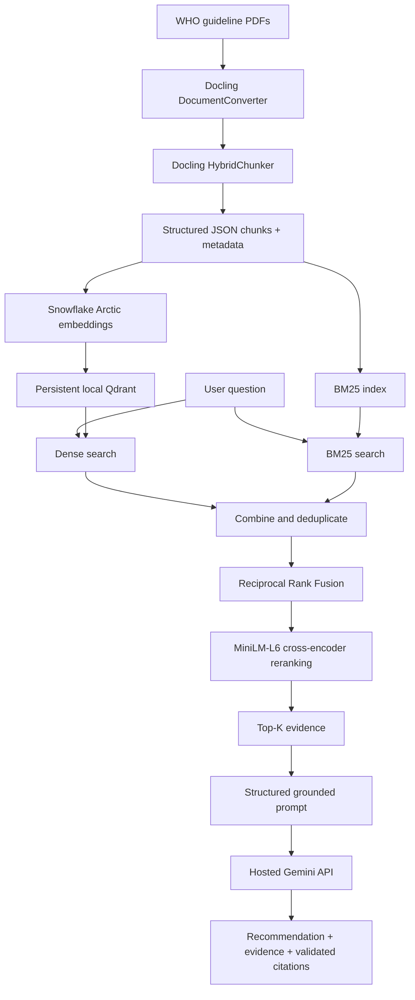

# Evidence-Based Hypertension Guidance RAG

A retrieval-augmented generation (RAG) system that answers questions using
evidence retrieved from WHO hypertension and nutrition guidelines. The current
application parses guideline PDFs, builds a persistent hybrid retrieval index,
reranks the evidence, and generates a structured answer with validated
citations.

The project is designed for general guideline education. It does not diagnose,
prescribe treatment, or provide individualized medical advice.

## Pipeline



## Technology Stack

| Pipeline stage | Technology |
|---|---|
| PDF parsing | Docling `DocumentConverter` |
| Structure-aware chunking | Docling `HybridChunker` |
| Embeddings | Sentence Transformers with `Snowflake/snowflake-arctic-embed-s` |
| Dense vector storage/search | Persistent local Qdrant |
| Keyword retrieval | BM25 |
| Hybrid fusion | Reciprocal Rank Fusion (RRF) |
| Reranking | `cross-encoder/ms-marco-MiniLM-L6-v2` |
| Hosted generation | Google Gemini, with optional Grok support |
| Structured output | Validated JSON converted to terminal output |
| Evaluation | Precision@K, Recall@K, Hit Rate@K, MRR and nDCG |
| Experiment history | CSV run and per-question records |

## Current Answer Format

The final answer is separated from retrieval debugging information:

```text
Recommendation
Supporting Evidence
Citations
Confidence
Safety
```

The model can cite only chunks supplied by the retriever. Citation metadata is
copied from the stored chunk records in Python rather than generated by the
model. If the evidence is insufficient, the system returns an explicit
insufficient-evidence response instead of guessing.

## Repository Structure

```text
.
├── DataSet/                       # Source guideline PDFs
├── artifacts/
│   ├── chunks/                    # Structured chunk JSON
│   ├── embeddings/                # Dense vectors and row manifest
│   ├── evaluation/                # Evaluation run history
│   ├── parsed_markdown/           # Docling Markdown exports
│   ├── qdrant_db/                 # Persistent local vector database
│   └── truth_table/               # Manual retrieval ground truth
├── notebooks/                     # Experiment comparison notebook/scripts
├── src/
│   ├── embedding/
│   ├── evaluation/
│   ├── generation/
│   ├── ingestion/
│   ├── reranking/
│   ├── retrieval/
│   └── vector_store/
├── tests/
├── main.py                        # Interactive application
├── requirements.txt
└── SETUP_AND_RUN.md               # Detailed setup and troubleshooting
```

## Quick Start

All Python commands must use the existing Conda environment `student_rag`.

### 1. Verify the environment

```bash
conda run -n student_rag python -c "import sys; print(sys.executable)"
```

### 2. Install dependencies

```bash
conda run -n student_rag python -m pip install -r requirements.txt
```

### 3. Download the local models

```bash
conda run -n student_rag python -c "from sentence_transformers import SentenceTransformer; SentenceTransformer('Snowflake/snowflake-arctic-embed-s', cache_folder='models', device='cpu')"

conda run -n student_rag python -c "from sentence_transformers import CrossEncoder; CrossEncoder('cross-encoder/ms-marco-MiniLM-L6-v2', cache_folder='models', device='cpu')"
```

The `models/` directory is intentionally ignored by Git.

### 4. Configure Gemini

```bash
cp .env.example .env
```

Add the API key to the local `.env` file:

```dotenv
GEMINI_API_KEY=replace-with-your-gemini-api-key
GEMINI_MODEL=gemini-3.5-flash-lite
GENERATION_PROVIDER=gemini
```

Never commit `.env` or paste real API keys into source files, issues, or chat.

### 5. Build the document index

Run these commands in order when creating artifacts from scratch:

```bash
conda run -n student_rag python -m src.ingestion.dataset_processor
conda run -n student_rag python -m src.embedding.embed_chunks --batch-size 4
conda run -n student_rag python -m src.vector_store.qdrant_store
```

### 6. Ask a question

```bash
conda run --no-capture-output -n student_rag python main.py
```

Useful options:

```bash
# Print complete retrieved chunks after the answer
conda run --no-capture-output -n student_rag python main.py --show-evidence

# Test retrieval without calling a hosted model
conda run --no-capture-output -n student_rag python main.py --retrieval-only

# Change the final number of evidence chunks
conda run --no-capture-output -n student_rag python main.py --top-k 10
```

## Retrieval Evaluation

The ground-truth examples contain a question and manually reviewed relevant
chunk IDs. Run the evaluation with:

```bash
conda run -n student_rag python -m src.evaluation.evaluate_retrieval
```

The evaluator measures Top-5, Top-10 and Top-20 retrieval quality and appends
results to:

```text
artifacts/evaluation/evaluation_runs.csv
artifacts/evaluation/evaluation_question_results.csv
```

Retrieval evaluation does not call Gemini or Grok and therefore does not spend
hosted generation tokens.

## Tests

```bash
conda run -n student_rag python -m unittest discover -s tests -v
```

## Safety and Grounding

- Answers must use only retrieved guideline evidence.
- Every supporting statement must reference one or more validated chunks.
- Unknown or invented chunk IDs are rejected.
- Citations include document, section, pages and chunk ID when available.
- The system does not provide diagnoses, medication changes, dosages or
  individualized treatment plans.
- Questions not supported by the indexed guidelines receive an
  insufficient-evidence response.

## Documentation

See [SETUP_AND_RUN.md](SETUP_AND_RUN.md) for the complete installation,
artifact-generation, execution and troubleshooting guide.

## Current Scope

The repository currently provides a command-line RAG backend. It does not yet
include a web UI, automatic Gemini-to-Grok failover, or generation-quality
evaluation.
