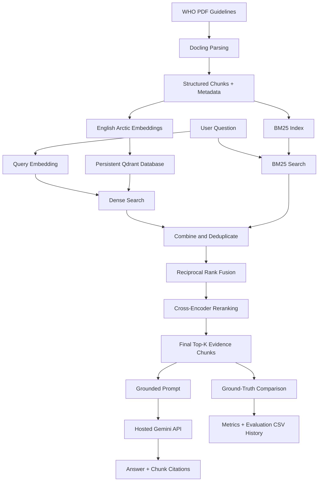

# Setup and Run Guide

This guide explains how to run the hypertension food-guidance RAG ingestion
pipeline after cloning or pulling the project from GitHub.

## System pipeline



Dense search and BM25 each retrieve a configurable candidate pool. Their full
union is deduplicated by `chunk_id`, ranked with RRF, and then reordered by the
cross-encoder before the final Top-K evidence is returned.
The interactive application sends those evidence chunks to Gemini with a strict
grounding prompt and asks it to cite supporting chunk IDs. Retrieval evaluation
remains separate and never calls the hosted LLM.

## 1. Get the project

For a new copy:

```bash
git clone <repository-url>
cd Plod_presure_Hackathon
```

For an existing copy:

```bash
git pull
```

Run all remaining commands from the project root.

## 2. Use the required Conda environment

This project uses the existing environment named `student_rag`.

Verify that it exists and that Python comes from the correct environment:

```bash
conda run -n student_rag python -c "import sys; print(sys.executable)"
```

The printed path should contain:

```text
envs/student_rag/bin/python
```

Do not use the system `python` or `python3`, and do not create a virtual
environment for this project.

## 3. Install project dependencies

Install the pinned packages into `student_rag`:

```bash
conda run -n student_rag python -m pip install -r requirements.txt
```

The main dependencies are Docling, Sentence Transformers, Qdrant Client,
Google GenAI, and the OpenAI-compatible client retained for optional xAI use.

## 4. Confirm the PDF dataset

The guideline PDFs must be present inside `DataSet/`. Subdirectories are
supported.

```text
DataSet/
├── Guideline for the pharmacological treatment of hypertension in adults.pdf
├── Potassium intake.pdf
└── sodium intake for adults and children.pdf
```

The pipeline discovers PDF files recursively, so individual filenames are not
hard-coded.

## 5. Download the embedding and reranker models

The model is not expected to be committed to Git because it is large. Download
`Snowflake/snowflake-arctic-embed-s` into the project-local `models/` cache:

```bash
conda run -n student_rag python -c "from sentence_transformers import SentenceTransformer; SentenceTransformer('Snowflake/snowflake-arctic-embed-s', cache_folder='models', device='cpu')"
```

The model has approximately 33 million parameters and only needs to be
downloaded once.

Download the lightweight English cross-encoder used after hybrid retrieval:

```bash
conda run -n student_rag python -c "from sentence_transformers import CrossEncoder; CrossEncoder('cross-encoder/ms-marco-MiniLM-L6-v2', cache_folder='models', device='cpu')"
```

## 5a. Configure the hosted generation API

Create an API key in [Google AI Studio](https://aistudio.google.com/apikey). Copy the example
configuration file, then edit `.env` and replace the placeholder locally:

```bash
cp .env.example .env
```

```dotenv
GEMINI_API_KEY=replace-with-your-gemini-api-key
GEMINI_MODEL=gemini-3.5-flash-lite
GENERATION_PROVIDER=gemini
RAG_API_TOKEN=replace-with-a-long-random-shared-token
RAG_RATE_LIMIT_PER_MINUTE=20
GUARDRAIL_CONFIDENCE_THRESHOLD=70
```

The application loads this file automatically. Do not put a real API key in
source code or commit `.env` to Git; it is already ignored. `.env.example`
contains only safe placeholders and can be committed for teammates.
Generate a unique `RAG_API_TOKEN`; the web server uses it to authenticate to
the Python chat API and protect hosted-model quota.

`GUARDRAIL_CONFIDENCE_THRESHOLD` is the minimum calibrated relevance score
required after reranking and before hosted generation. The default is 70.

## 6. Parse and chunk all PDFs

Run the Docling ingestion pipeline:

```bash
conda run -n student_rag python -m src.ingestion.dataset_processor
```

Generated files:

```text
artifacts/
├── parsed_markdown/
│   └── one Markdown file per PDF
└── chunks/
    └── one JSON chunk file per PDF
```

With the current three PDFs, the expected summary is:

```text
PDFs discovered: 3
Successfully processed: 3
Failed: 0
Total chunks created: 653
```

The exact chunk count may change if the PDFs, Docling version, tokenizer, or
chunking configuration changes.

## 7. Optionally export chunks as readable text

This creates simplified text files containing only the chunk ID and raw text:

```bash
conda run -n student_rag python -m src.ingestion.export_chunks_text
```

Output:

```text
artifacts/chunks_txt/
```

This step is useful for manually preparing the retrieval ground-truth dataset,
but it is not required for embedding.

## 8. Generate dense embeddings

Generate normalized embeddings from each chunk's `contextualized_text`:

```bash
conda run -n student_rag python -m src.embedding.embed_chunks --batch-size 4
```

The model runs on the CPU. A small batch size is used to reduce memory usage.

Expected result for the current dataset:

```text
Embedding matrix: (653, 384)
```

Generated files:

```text
artifacts/embeddings/
├── embeddings.npy
└── manifest.json
```

`embeddings.npy` contains the vectors. `manifest.json` maps every matrix row to
its chunk ID and source file.

## 9. Create the persistent Qdrant database

Insert the embeddings and complete chunk payloads into local Qdrant:

```bash
conda run -n student_rag python -m src.vector_store.qdrant_store
```

Expected result:

```text
Collection: hypertension_guidelines
Vector dimension: 384
Points indexed: 653
Points stored: 653
```

The persistent database is stored on disk at:

```text
artifacts/qdrant_db/
```

Running the command again updates points with the same stable IDs. To explicitly
delete and rebuild the collection, use:

```bash
conda run -n student_rag python -m src.vector_store.qdrant_store --recreate
```

Only use `--recreate` when intentionally replacing the existing collection.

## 10. Run grounded generation with Gemini

Use `--no-capture-output` so the interactive prompt receives terminal input:

```bash
conda run --no-capture-output -n student_rag python main.py
```

Enter a question when prompted. The application retrieves and reranks the
default Top-5 evidence chunks, then asks Gemini to answer using only that
evidence. To supply another number of chunks to Gemini, use `--top-k`:

```bash
conda run --no-capture-output -n student_rag python main.py --top-k 10
```

By default, dense search and BM25 each retrieve 25 candidates. Their full
deduplicated union is scored by RRF and then by the cross-encoder. You can
change the branch candidate pool independently:

```bash
conda run --no-capture-output -n student_rag python main.py --top-k 5 --candidate-k 30
```

The application prints the grounded answer, provider/model information and a
compact list of evidence sources. The user-facing answer is rendered as:

```text
Recommendation
Supporting Evidence
Citations
Confidence
Safety
```

Gemini returns constrained JSON. The application validates every cited chunk
ID, builds document/section/page citations from trusted retrieval metadata, and
never cites a chunk that was not supplied to generation. Provider/model and the
complete Top-K chunk list are printed separately under
`DEBUG / RETRIEVAL INFORMATION`.

To also print the complete retrieved chunk text and retrieval scores, add:

```bash
conda run --no-capture-output -n student_rag python main.py --show-evidence
```

Gemini is the default provider. Grok remains available for future use with
`--provider grok` once its team has API credits. To test retrieval without
spending API tokens or requiring a hosted API key, add:

```bash
conda run --no-capture-output -n student_rag python main.py --retrieval-only
```

## 11. Evaluate retrieval quality

Evaluate the reranked hybrid retriever against the manually reviewed ground truth:

```bash
conda run -n student_rag python -m src.evaluation.evaluate_retrieval
```

The default evaluation calculates Precision, Recall, Hit Rate, MRR and nDCG at
Top-5, Top-10 and Top-20. Every experiment is appended to:

```text
artifacts/evaluation/evaluation_runs.csv
artifacts/evaluation/evaluation_question_results.csv
```

The first CSV contains one row per run, including retrieval settings, input
fingerprints, environment information, aggregate metrics and a reproducible
command. The second contains per-question judgments for dashboards and error
analysis.

To measure the non-reranked RRF baseline with the same settings, add:

```bash
conda run -n student_rag python -m src.evaluation.evaluate_retrieval --no-reranker
```

Rerun a previous configuration using its recorded run ID:

```bash
conda run -n student_rag python -m src.evaluation.evaluate_retrieval \
  --rerun eval_YYYYMMDDTHHMMSSffffffZ
```

The evaluator warns if the ground truth, chunks, embedding manifest, source code
or Git commit changed since the original run.

## 12. Run the tests

```bash
conda run -n student_rag python -m unittest discover -s tests -v
```

The files under `scripts/` are manual smoke checks. They are intentionally
outside `tests/` because they load models, call a running API, or spend hosted
generation quota.

## 13. Run the web dashboard and chat

Install Node.js 20.9 or newer before running the frontend.

Copy the frontend example configuration and set `RAG_API_TOKEN` to exactly the
same random value used in the root `.env`:

```bash
cp web/.env.local.example web/.env.local
```

Start the Python API from the repository root:

```bash
conda run -n student_rag python -m uvicorn src.api.app:app --reload
```

In a second terminal, install the pinned frontend dependencies and start
Next.js:

```bash
cd web
npm install
npm run dev
```

Open `http://localhost:3000`. The dashboard loads sanitized metrics from the
latest successful evaluation run. The chat displays recommendation, supporting
evidence, citations, confidence, and the safety message.

## Complete pipeline command order

For a clean checkout, run these commands in order:

```bash
conda run -n student_rag python -m pip install -r requirements.txt

conda run -n student_rag python -c "from sentence_transformers import SentenceTransformer; SentenceTransformer('Snowflake/snowflake-arctic-embed-s', cache_folder='models', device='cpu')"

conda run -n student_rag python -c "from sentence_transformers import CrossEncoder; CrossEncoder('cross-encoder/ms-marco-MiniLM-L6-v2', cache_folder='models', device='cpu')"

conda run -n student_rag python -m src.ingestion.dataset_processor

conda run -n student_rag python -m src.embedding.embed_chunks --batch-size 4

conda run -n student_rag python -m src.vector_store.qdrant_store

conda run -n student_rag python -m src.evaluation.evaluate_retrieval

conda run -n student_rag python -m unittest discover -s tests -v
```

After setup, run the interactive retriever separately:

```bash
conda run --no-capture-output -n student_rag python main.py
```

The retrieval evaluation command does not call Gemini or Grok and does not spend hosted
API tokens.

## Common problems

### `ModuleNotFoundError`

Confirm that the command starts with `conda run -n student_rag`, then reinstall
the requirements:

```bash
conda run -n student_rag python -m pip install -r requirements.txt
```

### Embedding model cannot be found locally

Run both model-download commands from step 5. The embedding and reranking
pipelines use the local cache and do not silently download models at runtime.

### Qdrant says the database is already accessed

Only one local Qdrant client/process should open the database directory at a
time. Stop the other Python process and retry. Do not delete the database lock
while another process is running.

### The laptop runs out of memory during embedding

Close memory-heavy applications and reduce the batch size:

```bash
conda run -n student_rag python -m src.embedding.embed_chunks --batch-size 2
```

### Chunk IDs changed

Chunk IDs may change when PDFs or chunking settings change. Regenerate the
ground-truth evaluation dataset before calculating retrieval metrics.

### `GEMINI_API_KEY is not set`

Create `.env` from the safe example and add your real key before running
`main.py`:

```bash
cp .env.example .env
```

Use `--retrieval-only` when you intentionally want to run without a hosted model.

### `Chat API authentication is not configured`

Set the same long random `RAG_API_TOKEN` in the root `.env` and in
`web/.env.local`, then restart both servers. Never commit either local file.
